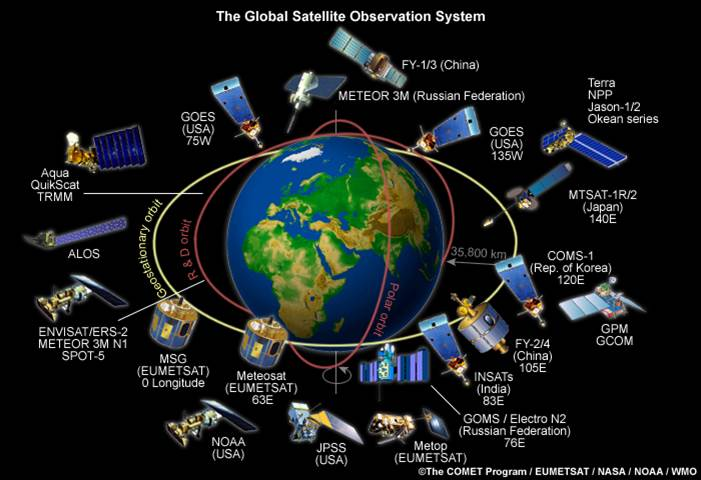
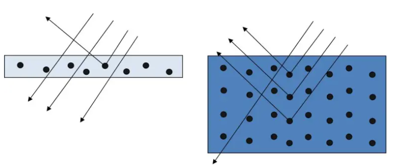
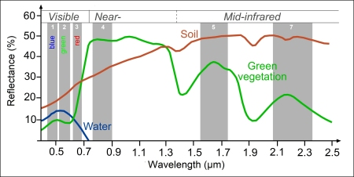
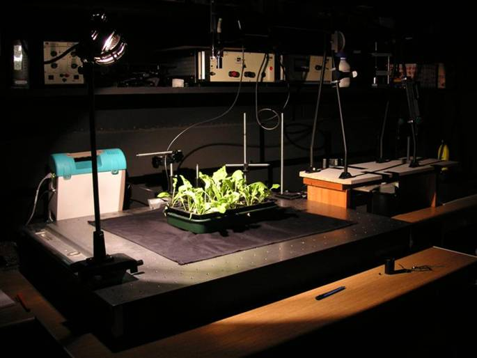

```{r setup, include=FALSE}
options(htmltools.dir.version = FALSE)
```

```{r xaringan-all, echo=FALSE}
library(countdown)
library(xaringan)
library(xaringanExtra)
library(knitr)

hook_source <- knitr::knit_hooks$get('source')
knitr::knit_hooks$set(source = function(x, options) {
  x <- stringr::str_replace(x, "^[[:blank:]]?([^*].+?)[[:blank:]]*#<<[[:blank:]]*$", "*\\1")
  hook_source(x, options)
})

xaringanExtra::use_broadcast()
xaringanExtra::use_freezeframe()
xaringanExtra::use_scribble()
#xaringanExtra::use_slide_tone()
xaringanExtra::use_search(show_icon = TRUE, auto_search	=FALSE)
xaringanExtra::use_freezeframe()
xaringanExtra::use_clipboard()
xaringanExtra::use_tile_view()
xaringanExtra::use_panelset()
xaringanExtra::use_editable(expires = 1)
xaringanExtra::use_fit_screen()
xaringanExtra::use_extra_styles(
  hover_code_line = TRUE,         
  mute_unhighlighted_code = TRUE  
)
```

class: center, title-slide, middle

background-image: url("img/CASA_Logo_no_text_trans_17.png")
background-size: cover
background-position: center


<style>
.title-slide .remark-slide-number {
  display: none;
}
</style>

```{r load_packages, message=FALSE, warning=FALSE, include=FALSE}
library(fontawesome)
```

# Remotely Sensing Cities and Environments

### Lecture 1: An Introduction to Remote Sensing

### 02/02/2022 (updated: `r format(Sys.time(), "%d/%m/%Y")`)

`r fa("paper-plane", fill = "#562457")` [a.maclachlan@ucl.ac.uk](mailto:a.maclachlan@ucl.ac.uk)
`r fa("twitter", fill = "#562457")` [andymaclachlan](https://twitter.com/andymaclachlan)
`r fa("github", fill = "#562457")` [andrewmaclachlan](https://github.com/andrewmaclachlan)
`r fa("location-dot", fill = "#562457")` [Centre for Advanced Spatial Analysis, UCL](https://www.ucl.ac.uk/bartlett/casa/)
`r fa("file-pdf", fill = "#562457")` [PDF presentation](https://github.com/andrewmaclachlan/CASA0023-lecture-1/blob/main/index.pdf)


<a href="https://github.com/andrewmaclachlan" class="github-corner" aria-label="View source on GitHub"><svg width="80" height="80" viewBox="0 0 250 250" style="fill:#fff; color:#151513; position: absolute; top: 0; border: 0; left: 0; transform: scale(-1, 1);" aria-hidden="true"><path d="M0,0 L115,115 L130,115 L142,142 L250,250 L250,0 Z"></path><path d="M128.3,109.0 C113.8,99.7 119.0,89.6 119.0,89.6 C122.0,82.7 120.5,78.6 120.5,78.6 C119.2,72.0 123.4,76.3 123.4,76.3 C127.3,80.9 125.5,87.3 125.5,87.3 C122.9,97.6 130.6,101.9 134.4,103.2" fill="currentColor" style="transform-origin: 130px 106px;" class="octo-arm"></path><path d="M115.0,115.0 C114.9,115.1 118.7,116.5 119.8,115.4 L133.7,101.6 C136.9,99.2 139.9,98.4 142.2,98.6 C133.8,88.0 127.5,74.4 143.8,58.0 C148.5,53.4 154.0,51.2 159.7,51.0 C160.3,49.4 163.2,43.6 171.4,40.1 C171.4,40.1 176.1,42.5 178.8,56.2 C183.1,58.6 187.2,61.8 190.9,65.4 C194.5,69.0 197.7,73.2 200.1,77.6 C213.8,80.2 216.3,84.9 216.3,84.9 C212.7,93.1 206.9,96.0 205.4,96.6 C205.1,102.4 203.0,107.8 198.3,112.5 C181.9,128.9 168.3,122.5 157.7,114.1 C157.9,116.9 156.7,120.9 152.7,124.9 L141.0,136.5 C139.8,137.7 141.6,141.9 141.8,141.8 Z" fill="currentColor" class="octo-body"></path></svg></a><style>.github-corner:hover .octo-arm{animation:octocat-wave 560ms ease-in-out}@keyframes octocat-wave{0%,100%{transform:rotate(0)}20%,60%{transform:rotate(-25deg)}40%,80%{transform:rotate(10deg)}}@media (max-width:500px){.github-corner:hover .octo-arm{animation:none}.github-corner .octo-arm{animation:octocat-wave 560ms ease-in-out}}</style>


---
class: inverse, center, middle
# Let's start with a rocket launch`r emo::ji("rocket")` and a drum beat `r emo::ji("musical_note")`


---
class: inverse, center, middle
```{r xaringan-logo, echo=FALSE}
xaringanExtra::use_logo(
  image_url = "img/casa_logo.jpg",
  width = "50px",
  position = xaringanExtra::css_position(top = "1em", right = "2em")

)
```

<iframe width="560" height="315" src="https://www.youtube.com/embed/bmoYMzGBN5s" title="YouTube video player" frameborder="0" allow="accelerometer; autoplay; clipboard-write; encrypted-media; gyroscope; picture-in-picture" allowfullscreen></iframe>

---

# Lecture outline 
.pull-left[

- How to use the lectures

- Expectations

- Module housekeeping (locations, timings etc)

- Module aims + objectives

- Module assessment

- Introduction to remote sensing

- Questions
]
.pull-right[
```{r echo=FALSE, out.width='100%'}
knitr::include_graphics('img/satellite.png')
```
]

---
```{r, echo=FALSE}
xaringanExtra::use_progress_bar(color = "#0051BA", location = "bottom")
```

# How to use the lectures

- Slides are made with [xaringan](https://slides.yihui.org/xaringan/#1)

- `r fa("magnifying-glass")` In the bottom left there is a search tool which will search all content of presentation

- Control + F will also search 

- Press enter to move to the next result 

- `r fa("pencil")` In the top right let's you draw on the slides, although these aren't saved.

- Pressing the letter `o` (for overview) will allow you to see an overview of the whole presentation and go to a slide

- Alternatively just typing the slide number e.g. 10 on the website will take you to that slide

- Pressing alt+F will fit the slide to the screen, this is useful if you have resized the window and have another open - side by side. 

---

# Expectations

## Student

- Staff to be present and available for questions

- Taught current methods applicable to MSc study 

- To be challenged 

## Staff

- CASA0005 (GIS) is a pre-requisite to this module, so most content / code presented there will be assumed knowledge here

- Engage with the staff and material 

- Challenge yourself 

- Complete the set assignments/tasks and come prepared 

---
# Module housekeeping 

.pull-left[
Sessions:

- 1 hour weekly lecture 

- 2 hour practical 

- Drop in sessions
  - will discuss assignment tasks
  - Q and A
  - time for us to address any issues

- Resources, including reading are always provided in the practical book. There may be some extra links in lectures to support points made.
  ]
  
.pull-right[
```{r echo=FALSE, out.width='85%'}

```
.small[Inflation Tests of the Echo 1 Satellite in Weeksville, N.C. Source:[Original from NASA. Digitally enhanced by rawpixel.](https://www.rawpixel.com/image/418674/free-photo-image-silver-nasa-balloon)
] 
]
???
Echo1-first passive US communications satellite

---
class: inverse, center, middle

# Module aims

# This module will enable students to operationalise remotely sensed Earth observation data for informing decisions on environmental hazards arising from a changing climate, specifically in relation to (a) urban areas and (b) future urban sustainability

---

# Module learning outcomes

At the end of this module you should be able...

`r fa("square-check", fill = "black")` Create a **reproducible online portfolio workbook**

`r fa("square-check", fill = "black")` Explain and evaluate **common issues with urban and environmental policies** at the local, national and international level that fail to consider spatial data 

`r fa("square-check", fill = "black")` Revise vague and ambiguous development **targets**

`r fa("square-check", fill = "black")` Appropriately pre-process Earth observation imagery ready for analysis 

`r fa("square-check", fill = "black")` Apply published methodologies to extract meaning from Earth observation data  

`r fa("square-check", fill = "black")` Combine a **variety of spatial data** to demonstrate the benefits of data-informed governance and planning.  

`r fa("square-check", fill = "black")` Create and design a reproducible workflow for consistent monitoring of urban and environmental metrics 

`r fa("square-check", fill = "black")` Critique and optimise recently developed metropolitan climate mitigation strategies using appropriate spatial data, optimizing financial investment and environmental outcomes 

???

Bold type denotes key aspects of the module
---
# Assessment 1 (30%)

* Group presentation 
  * A 10-minute group presentation "bidding" as contractors for a tender to solve an issue from policy. 
  * Groups will select a single city and detail how Earth observation data could be applied to or improve their local, national or metropolitan development plans in achieving global development goals (e.g. New Urban Agenda, Sustainable Development Goals or the Sendai Framework for disaster risk reduction). 
  * The city has a total of £500,000 to spend.
  * The presentation will require **no analysis** to be undertaken but must be done in markdown

**Group code**

> all students in each group are active group members, respect each other, make appropriate and valid contributions, provide timely responses to their group and do not place unnecessary pressure or expectations on each other (e.g. working unsociable hours).

---
# Assessment 2 (70%)


* Weekly learning diary using Quarto:
  * **summarise, analyse and comment on** the material presented each we
  * not a formal piece of writing 
  * no specific formatting requirement (e.g. written response or flowcharts)
      - Summary: summary of the content
      - Applications: data / concepts / methods (or related concepts) have been applied in literature / policy or other studies
      - Reflection: personal reflection on the presented content 

You should not just restate what has been presented in the lectures

* What have you learnt
* How has it been used or applied in literature
* What are your thoughts on this

> all students should be familar with R, RStudio, Git and GitHub.
---

class: inverse, center, middle

# all tools required will be taught 
# see the markscheme and requirements document
--

#`r emo::ji("smile")`
---
class: inverse, center, middle


# Not only do I want you to learn some remote sensing skills

# A goal of the module is to create an online personal portofolio of your work

---

class: inverse, center, middle

# Now a short lecture

---

# Have you used..or seen...

Where have you seen or used remotely sensed data before? 
.pull-left[
### Source
.can-edit[
- thing one

- thing two
]]

.pull-right[
### Application
.can-edit[
- thing one

- thing two
]]

`r countdown(minutes=1, seconds =0, warn_when = 10, bottom=0, right=0)`


---

# Have you used..or seen...

Where have you seen or used remotely sensed data before? 
.pull-left[
### Source

- Dynamic World (Sentinel data)

- Landsat

- Sentinel 

- Several (Landsat and Sentinel)

- Landsat

- Several (Landsat and Sentinel)

- Several (Landsat and Sentinel and SAR)


]

.pull-right[
### Application

- land cover data set with 10m resolution (real time)

- Urban / green space coverage and accessibility

- Pollution studies 

- Illegal logging 

- Forest fires 

- Temperature studies

- Flooding / disaster response / building footprints

]


---
# Introduction to remote sensing 

.pull-left[

* NASA defines remote sensing as **acquiring information from a distance**

* Interchangeable used with **Earth Observation** or **EO**

* This is achieved through **sensors** mounted on a platform
  * Satellites `r emo::ji("satellite")`
  * Planes (aerial imagery) `r emo::ji("money")`
  * Drones 
  * Phones
  * Free standing on the ground or sea (with hand held devices)
  
* More than 150 satellites in orbit carrying sensors 
]

.pull-right[

```{r echo=FALSE, out.width='100%'}

```

.small[Remote Sensing & Sustainable Land Use. Source:[Industry Tap](https://www.industrytap.com/remote-sensing-sustainable-land-use/33218)
] 
]

---

# Introduction to remote sensing 


The sheer volume of space craft and sensor is causing a bit of a problem with space junk that is tracked by NASA...27,000 pieces of it!

```{r echo=FALSE, out.width='50%', fig.align='center'}

```

.small[Space Debris. Source:[NASA](https://www.nasa.gov/mission_pages/station/news/orbital_debris.html)
] 

---
class: inverse, center, middle

## The following slides are just an introduction, you might have many questions, we will go into more detail throughout the term 
---

#Why is this an interesting field...

* Mass of data - satellites collect data on the same points on Earth every day to every 16 days. 

* Data is a bit "harder" to use and interpret than traditional GIS data (e.g. points, polygons) meaning it doesn't have broad use in public realm (e.g. not on London Data store)

* Frequency of update and less reliance on authorities (e.g London Atlas)

* More free resources to process large volumes of data (e.g. **Google Earth Engine**)

* Emergence of policy decisions being made using remotely sensed data

* Filled with jargon that often isn't as complicated as it sounds

---
#Why is this an interesting field...GEE


```{r echo=FALSE, out.width='75%', fig.align='center'}

```

.small[GEE apps. Source:[GEE](https://www.earthengine.app/)
] 


---

# The two types of sensor
.pull-left[
```{r echo=FALSE, out.width='100%'}
knitr::include_graphics('img/Passive-and-active-sensors-systems-working-principles-24.png')
```
.small[Passive and active sensors systems working principles. Source:[Nadhir Al-Ansari](Source: https://www.researchgate.net/figure/Passive-and-active-sensors-systems-working-principles-24_fig2_344464269)
] 
]

.pull-right[
**Passive**  

* Use energy that is available
* Don't emit anything 
* Detecting **reflected** energy from the sun
* Energy is in electromagnetic waves...
* Such as: Human eye, camera, satellite sensor


**Active**

* Have an energy source for illumination 
* Actively emits electormagentic waves and then waits to receive 
* Such as: Radar, X-ray, LiDAR


Sensors can be mounted on any platform. 
]

---
class: inverse, center, middle


<iframe width="560" height="315" src="https://www.youtube.com/embed/lwfJPc-rSXw?start=8" title="YouTube video player" frameborder="0" allow="accelerometer; autoplay; clipboard-write; encrypted-media; gyroscope; picture-in-picture; web-share" allowfullscreen></iframe>

---

# Electromagnetic waves 2

Electromagnetic radiation (has both electric and magnetic fields) propagates (moves) as waves

* Perpendicular electric and magnetic field 
* $\lambda$ = **wavelength**, distance between two crests 
* $c$ = velocity of light 3 x 10^8 meters per second
* $v$ = frequency, rate of oscillation (full oscillations in a time unit) 

$\lambda$ = $c$ / $v$
```{r echo=FALSE, out.width='60%', fig.align='center'}
knitr::include_graphics('img/electormagneticfield.PNG')
```
.small[Source: [Principles of Remote sensing](http://www.wamis.org/agm/pubs/agm8/Paper-2.pdf)
]

---
# Electromagnetic waves 3

Oscillation vs wavelength

```{r echo=FALSE, out.width='75%', fig.align='center'}

```
.small[Source: [What is a Wavelength?](https://www.twinkl.co.uk/teaching-wiki/wavelength)
]

---

# Interacting with Earth's surface 

Electromagnetic radiation(EMR) (e.g. from the sun) isn't automatically reflected. It experiences a number of changes prior to hitting the sensor....**these include:**

**Surface**
  * Energy being absorbed by the surface
  * Energy being transmitted through the surface
  
**Atmospheric**  
  * Energy can be scattered by particles in the atmosphere (next slide)

```{r echo=FALSE, out.width='35%', fig.align='center'}

```
.small[Source: [Principles of Remote sensing](http://www.wamis.org/agm/pubs/agm8/Paper-2.pdf)
]

---
# Terms

* Waves of an electromagnetic field, travel through space and carry radiant energy = Electromagnetic radiation (EMR). Waves are part of the EMR spectrum.

* Energy carried by EMR waves = radiant energy

* Energy per unit of time = radiant flux

* Energy from the sun = incoming short wave radiation **or** shortwave radiation 

* Energy (solar power) from the sun per unit area per unit time (from electromagnetic radiation) = solar irradiance (per unit time - flux)

* Energy leaving a surface per unit area per unit time = Exitance (emittance) (per unit time - flux)

Flux means time here.

---

# Interacting with Earth's surface 2

There are three types of atmospheric scattering:

* Rayleigh = particles are very small compared to the wavelength 
* Mie = particles are the same size compared to the wavelength
* Non selective = particles are much larger than the wavelength 

```{r echo=FALSE, out.width='60%', fig.align='center'}

```
.small[Source: [Julien Chimot, from Bovensmann et al., 2011](https://julien-chimot-research.blog/the-light-energy-source-in-remote-sensing/)
]

---
class: inverse, center, middle

# Scattering in action....

--
# Why is the sky blue

---

# Raleigh scattering in action

* Sunlight is scattered by  particles in the atmosphere

* Smaller wavelengths scatter easier - These are the blue hues

* At sunrise or sunset there is much more atmosphere to pass through so more scattering occurs

* When the sun's angle changes the blue light scatter doesn't reach our eyes as the distance is increased = so longer wavelengths reach us= reds and oranges. 

```{r echo=FALSE, out.width='60%', fig.align='center'}

```
.small[Source: [Explaining Science](https://explainingscience.org/2015/09/30/why-is-the-sky-blue/)
]
---
# Raleigh scattering in action

```{r echo=FALSE, out.width='60%', fig.align='center'}

```
.small[Source: [Explaining Science](https://explainingscience.org/2015/09/30/why-is-the-sky-blue/)
]


```{r echo=FALSE, out.width='45%', fig.align='center'}
knitr::include_graphics('img/sky4.en.png')
```
.small[Source: [NASA](https://spaceplace.nasa.gov/blue-sky/en/)
]
---
class: inverse, center, middle

# Scattering in action....

--
# Why does the moon have a black sky?

---
# Scattering in action....

**Why does the moon have a black sky?**

There is no atmosphere on the moon so no scattering can happen

The sun appears whiter

Astronauts struggled to gauge distance as on Earth the atmosphere makes far things hazy.

```{r echo=FALSE, out.width='55%', fig.align='center'}

```
.small[Source: [Explaining Science](https://explainingscience.org/2015/09/30/why-is-the-sky-blue/)
]

---
class: inverse, center, middle

# Scattering in action....

--

# Why is the ocean (usually) blue?

---
# Scattering in action....

**Why is the ocean (usually) blue?**

It absorbs the red yellow and green wavelengths but reflects (or scatters) blue.

Same concept **blue light shorter wavelength and more easily scatters**

Shallow water can is clear as not many molecules scatter the light. Deeper ocean = very blue..

Think about dropping ball into a dense forest...it will hit more branches...

```{r echo=FALSE, out.width='60%', fig.align='center'}

```
.small[Left: shallow water is clear, right deep water is blue. Source: [Words in mOcean blog](https://wordsinmocean.com/2015/10/21/if-water-is-clear-why-is-the-ocean-blue/)
]

---
# Considering this...

## What do you think is a big issue which can prevent capture of land / the target?

--

###Hint: It's a very big problem in the UK...
--

###Hint: given the weather 

---

# Clouds

```{r echo=FALSE, out.width='60%', fig.align='center'}

```
.small[Source: [Landsat Collections Land Cloud Cover](https://www.usgs.gov/landsat-missions/landsat-collections-land-cloud-cover)
]
---

# Active sensors

Several different types but... Synthetic Aperture Radar (SAR) can "see through clouds"

* Radar collects at longer wavelengths than optical sensors - pass through clouds that have smaller particle sizes
* Has it's own bands - e.g. P, L, S, C, X, Ku, K
* Wavelength dictates how far it can penetrate into medium
* See through clouds, volcanic ash + atmospheric conditions
* Collects data at night

Much more on SAR towards the end of the module.

.pull-left[
```{r echo=FALSE, out.width='80%', fig.align='center'}

```
.small[Source: Ollie Ballinger]
]

.pull-right[
```{r echo=FALSE, out.width='80%', fig.align='center'}
knitr::include_graphics('img/SARticle_microwave_fig-05.jpg')
```
.small[Source: [NASA, what is SAR](https://earthdata.nasa.gov/learn/backgrounders/what-is-sar)
]
]
---

class: inverse, center, middle

## Some context on less commonly documented surface interactions

### More information in future sessions

---

# Interacting with Earth's surface 

**less commonly documented surface interactions**

Bidirectional Reflectance Distribution Function (BRDF)
  * View (e.g. sensor) and illumination (e.g. sun) angles can change
  * Energy being reflected from the surface that is smooth or diffuse.

```{r echo=FALSE, out.width='35%', fig.align='center'}

```
.small[Source: [Professor Crystal Schaaf’s Lab](https://www.umb.edu/spectralmass/terra_aqua_modis/modis)
]

---

# Interacting with Earth's surface 

**less commonly documented surface interactions**

Bidirectional Reflectance Distribution Function (BRDF) examples

"This is a black spruce forest in the BOREAS experimental region in Canada.
* Left: backscattering (sun behind observer); note the bright region (hotspot) where all shadows are hidden.
* Right: forward scattering (sun opposite observer); note the shadowed centers of trees and transmission of light through the edges of the canopies."

```{r echo=FALSE, out.width='40%', fig.align='center'}

```
.small[Source: [Professor Crystal Schaaf’s Lab, Photograph by Don Deering](https://www.umb.edu/spectralmass/terra_aqua_modis/modis)
]
---

# Interacting with Earth's surface 

**SAR data - less commonly documented surface interactions**

**Much more on this later in the term**

  * Polarization
     * Applicable to Radar: Electromagnetic waves are polarized and the direction depends on the oscillation of the electromagnetic field. When they are reflected from the surface the waves can be linked to surface properties - roughness, shape, orientation, moisture, salinity, density. 
    * Single polarization: same polarization transmitted and received
    * Dual polarization: One sent, different one received
    * Quad polarization: system can transmit and receive four types
    * Source: [NASA](https://nisar.jpl.nasa.gov/mission/get-to-know-sar/polarimetry/) and [Utwente living textbook](https://ltb.itc.utwente.nl/518/concept/92622)
  
  * Fluoresence 
      * Object illuminated with radiation of one wavelength emits radiation at another wavelength

---
# Interacting with Earth's surface 

**Polarization - much more on this later in term**


.pull-left[

  * Different ploarizations:
    * orientation of the plane in which EMR waves transmitted..
    * "direction of travel of an electromagnetic wave vector’s tip: vertical (up and down), horizontal (left to right), or circular (rotating in a constant plane left or right)."
    
* Single = 1 horizontal (or vertical)  

* Dual = transmits and receives both horizontal and vertical

* HH = emitted in horizontal (H) and received in horizontal (H)
    
]

.pull-right[

```{r echo=FALSE, out.width='100%', fig.align='center'}
knitr::include_graphics('img/polarisation.png')
```

.small[Polarization. Source:[Wetland Monitoring and Mapping Using Synthetic Aperture Radar](https://www.intechopen.com/chapters/63701)
]

]
 

---

class: inverse, center, middle

## Satellite (and aerial) sensors are affected by the atmopsheric scattering

## We can remove this through removing them through **atmospheric correction**

## More on this in future lectures

---

class: inverse, center, middle

## Take home message (from this section)

### It's not as simple to just say energy from sun is reflected by Earth to a sensor

### There are many interactions that influence the data being created and we use

---

# Data formats 

.pull-left[
```{r echo=FALSE, out.width='100%'}
knitr::include_graphics('img/raster_dataset.png')
```
.small[Source: [QGIS documentation](https://docs.qgis.org/2.18/en/docs/gentle_gis_introduction/raster_data.html)]
]

.pull-right[

* In the majority of cases remotely sensed data is raster...
  * band interleaved by line (BIL)
  * band sequential (BSQ)
  * band interleaved by pixel (BIP)
  * GeoTIFF (most common)


* However this is dependent on the sensor. 

* For example, LiDAR is point data with x,y (like we've seen before) but also a z dimension (height). But LiDAR is often used to create a raster dataset such as an elevation model

* See [ArcMap help for examples of BIL, BSQ and BIP](https://desktop.arcgis.com/en/arcmap/10.3/manage-data/raster-and-images/bil-bip-and-bsq-raster-files.html)
]

---

class: inverse, center, middle
# The three (well four) **resolution** amigos 


---

# Four resolutions 

Remotely sensed data and applications will vary based on the four resolutions

* Spatial = the size of the raster grid per pixel (e.g. 20cm or 30m)

* Spectral = the number of bands it records data in...more soon

* Temporal = the time it revisits (e.g. daily, every 7 days, on demand `r emo::ji("airplane")`)

* Radiometric = identify differences in light or reflectance, in practice this is the range of possible values.
  * an 8 bit sensor has values between 0 and 255 (256 possibilities)
  * an 11 bit sensor has values between 0 and 2047(2048 possibilities)
  
Examples to follow...
---

# Spatial resolution 

* The size of the raster cells

* Range between 10cm and several kilometers.

```{r echo=FALSE, out.width='50%', fig.align='center'}

```
---

# Spectral resolution 1

* As humans we see in the visible part of the electromagnetic spectrum, meaning the images we see are composed of red, green and blue wavelengths --- the visible spectrum.

* Objects appear a certain colour as that's the wavelength that is reflected, with the others being absorbed (or scattered - like sunsets). 

* We can take values for each wavelength (or a band of several wavelengths) across the electromagnetic spectrum to create a **spectral signature** 

* Every feature on Earth will have a unique spectral signature...

```{r echo=FALSE, out.width='40%', fig.align='center'}

```
.small[Source: [Science Education through Earth Observation for High Schools](https://seos-project.eu/classification/classification-c01-p05.html)]


---
class: inverse, center, middle


<iframe width="560" height="315" src="https://www.youtube.com/embed/lwfJPc-rSXw?start=198" title="YouTube video player" frameborder="0" allow="accelerometer; autoplay; clipboard-write; encrypted-media; gyroscope; picture-in-picture; web-share" allowfullscreen></iframe>

---

# Spectral resolution 2 

* However, we are often constrained to atmospheric windows.

* Water vapour, ozone, carbon dioxide and atmospheric molecules block parts of the the spectrum

* Atmospheric transmission (y axis) [is the transmission of that wavelength (in other words how much is not absorbed by gasses)](https://www.usna.edu/Users/oceano/pguth/md_help/remote_sensing_course/atmos_transmit.htm)

* We can only observe where there aren't absorbed by the atmosphere.  

```{r echo=FALSE, out.width='75%', fig.align='center'}
knitr::include_graphics('img/Atmospheric-Electromagnetic-Opacity.png')
```
.small[Source: [GIS geography](https://gisgeography.com/atmospheric-window/)]

---
# Spectral resolution 3 


```{r echo=FALSE, out.width='100%', fig.align='center'}
knitr::include_graphics('img/EMS-Introduction_0.jpeg')
```
.small[Source: [NASA Science](https://earthdata.nasa.gov/learn/backgrounders/remote-sensing#orbits)]

---
# Spectral resolution 4 

* We classify the type or spectral resolution based on the number of bands it observes

* Each band is **usually** provided as a separate raster layer

* This means a spectral signature can be discrete (e.g. multi spectral) or continuous (e.g. hyper spectral)

```{r echo=FALSE, out.width='80%', fig.align='center'}
knitr::include_graphics('img/What-is-Hyperspectral-Imaging.png')
```
.small[Source: [nieros](https://www.nireos.com/hyperspectral-imaging/)]

---
# Spectral resolution 5

Measuring spectral reflectance isn't constrained to senors mounted on satellites, planes or drones

It can also be done using a **"spectroradiometer"** in a lab or in the field...

However, this is dependent on the incident (incoming) radiation so it must be calibrated with a pure white reference panel...which you must never touch directly!

.pull-left[
```{r echo=FALSE, out.width='80%', fig.align='center'}

```
.small[Source: [Richard Treves](https://www2.geog.soton.ac.uk/users/trevesr/obs/rseo/electromagnetic_radiation_and_plants.html)]
]

.pull-right[
```{r echo=FALSE, out.width='50%', fig.align='center'}
knitr::include_graphics('img/calibration_panel.jpg')
```
.small[Source: Andy MacLachlan]
]

.small[satellite data is also compared to reference sites, know as vicarious calibration]

---

# Radiometric resolution 

The ability of a sensor to identify and show small differences in energy. The higher = the more sensitive it is.

* 8 bit = 256 possible values 

* 4 bit = 16 possible values

```{r echo=FALSE, out.width='80%', fig.align='center'}

```
.small[Source: [GIS geography](https://gisgeography.com/bit-depth/)]

Lower the radiometric resolution the lower the quality of the image and possibility to differentiate features. 

---

# Temporal resolution 

* The revisit time of the sensor

* Low resolution means it has a large pixel size (e.g. MODIS is 500m by 500m pixel)

```{r echo=FALSE, out.width='60%', fig.align='center'}

```
.small[Source: [ESRI](https://www.esri.com/about/newsroom/arcuser/a-world-of-imagery-available-through-arcgis-online/)]

---

# Other considerations 

* Type of orbit 
  * geosynchronous orbit (GSO) = satellite matches the Earth's rotation
  * geostationary orbit = holds same position, usually only for communications but some sensors are geostationary.  

```{r echo=FALSE, out.width='80%', fig.align='center'}
knitr::include_graphics('img/20087311523106900-2008-09TatemF2.jpg')
```
.small[Source: [American Scientist](https://www.americanscientist.org/article/fifty-years-of-earth-observation-satellites)]

---

# Balancing act

* The type of question you are looking to answer will dictate what sensor is most appropriate.

  * Size of features 
  
  * Date range
  
  * Revisit requirement
  
  * Spectral sensitivity 
  
  * Cost  
  
---

# Conclusion

* Active and passive remote sensing

* Considered how electromagnetic waves interact with
  * Earth's surface
  * Atmosphere
  
* Explored the 4 resolutions of remotely sensed data
  * Spectral
  * Spatial
  * Temporal
  * Radiometric
  
* Identified how constraints (environmental or sensor) can dictate the choice of data we use. 

---

# Practical 

* Loading Landsat and Sentinel data

* Exploring SNAP and R

* Selecting regions of interest

* Plotting spectral signatures 

```{r include=FALSE}
library(renderthis)
renderthis::to_pdf("index.html")
```
